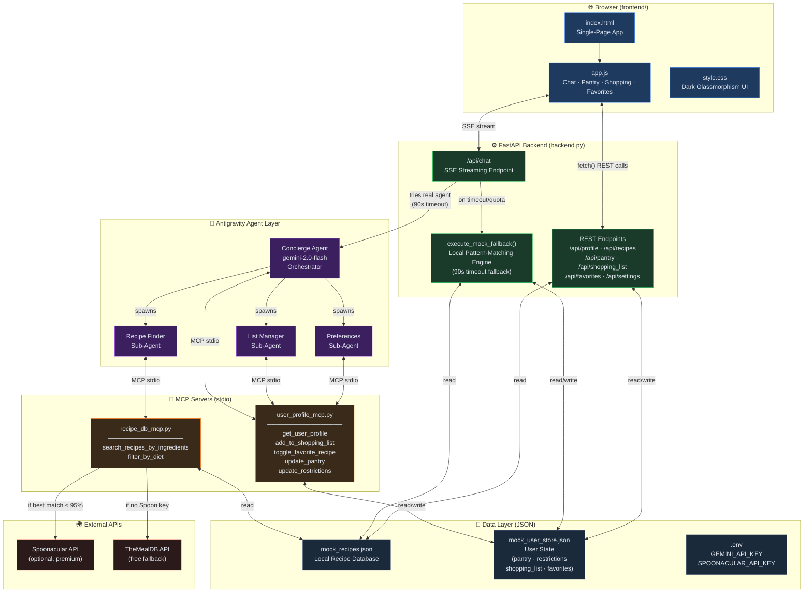
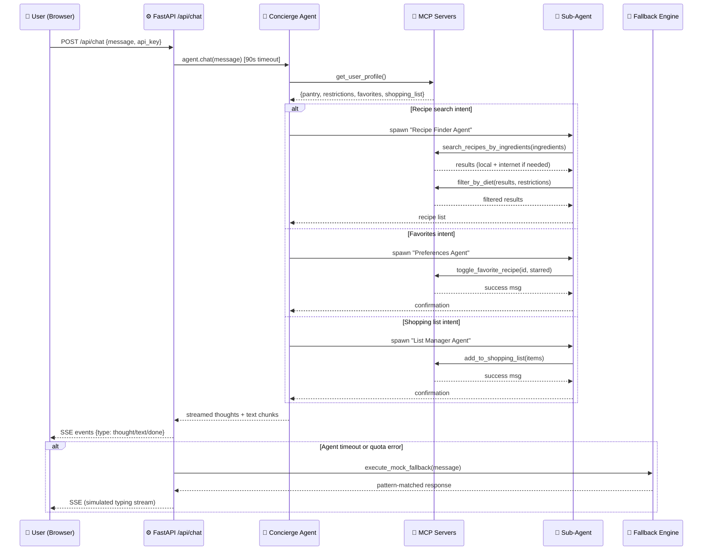
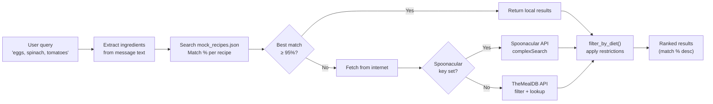

# RecipeLab — Architecture Diagram

## System Overview

---

## Request Lifecycle: Chat Message

---

## Data Flow: Recipe Search

---

## Component Summary

| Layer | File(s) | Technology |
|---|---|---|
| **Frontend** | `frontend/index.html`, `app.js`, `style.css` | Vanilla HTML/CSS/JS, Outfit font |
| **Backend API** | `backend.py` | Python, FastAPI, Uvicorn |
| **AI Orchestration** | `backend.py` | Google Antigravity SDK, `gemini-2.0-flash` |
| **MCP: Recipes** | `recipe_db_mcp.py` | FastMCP, httpx |
| **MCP: User Profile** | `user_profile_mcp.py` | FastMCP |
| **Local Data** | `mock_recipes.json`, `mock_user_store.json` | JSON flat files |
| **Config** | `.env` | python-dotenv |
| **Launcher** | `start.py` | subprocess / uvicorn |
